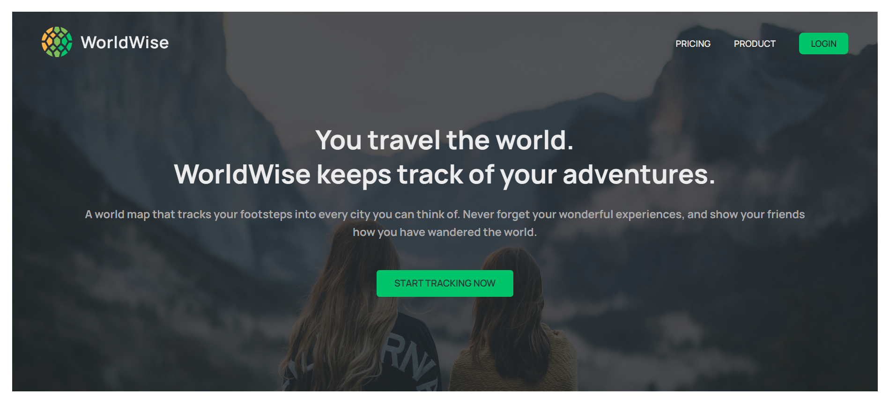
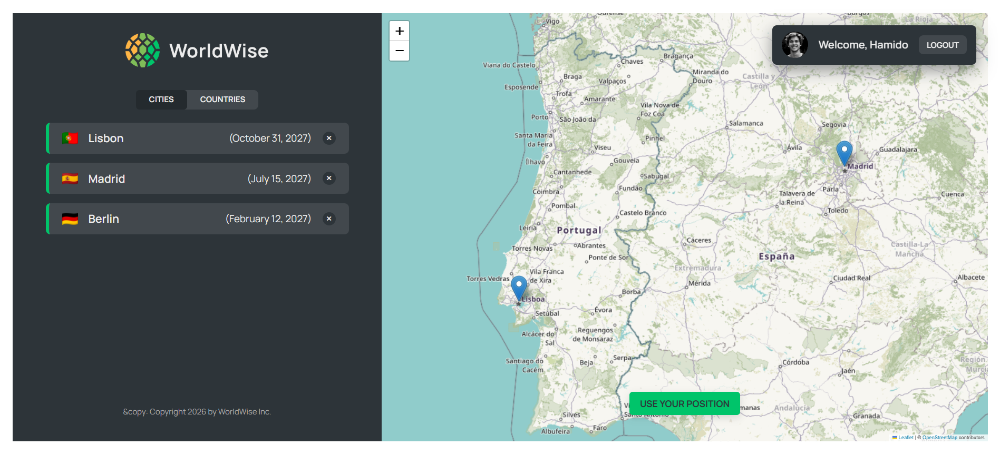
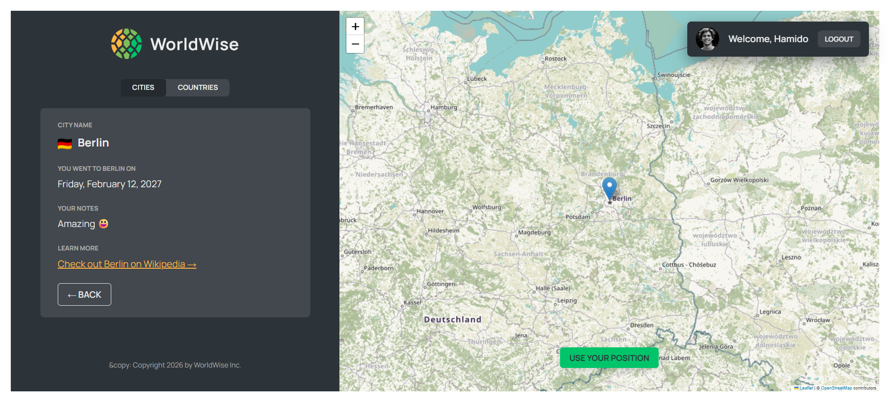
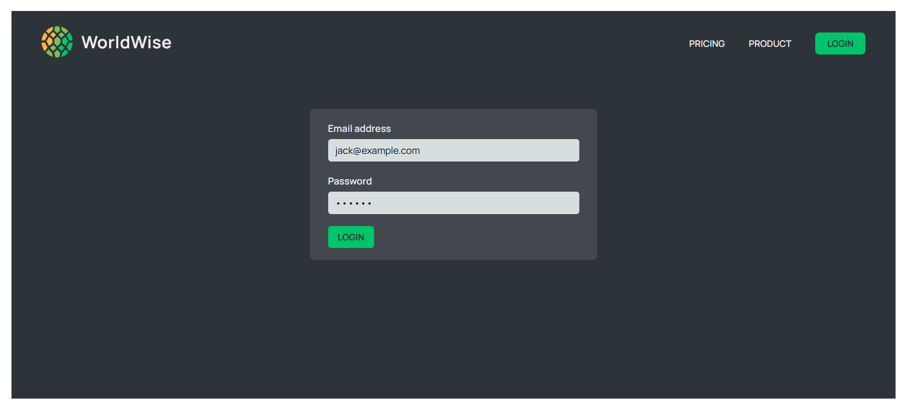

# 🌍 WorldWise

WorldWise is a modern React application that helps users track and manage the cities they have visited around the world through an interactive map experience.

The application allows users to add cities, explore countries, view detailed city information, and manage travel locations using dynamic routing, global state management, and real-time map interactions.

---

## 🚀 Features

- 🗺️ Interactive map integration using Leaflet
- 📍 Add and delete visited cities
- 🌍 Display countries based on visited cities
- 🔎 View detailed information for each city
- 📌 Detect and use current geolocation
- 🔄 Dynamic routing with React Router
- 🔐 Fake authentication system with protected routes
- ⚡ Route-based code splitting using React.lazy and Suspense
- 🧠 Global state management using Context API and useReducer
- 🎯 URL search params for map positioning
- 🪝 Reusable custom hooks for geolocation and URL state management
- 🚦 Loading and error state handling
- 📱 Responsive UI with CSS Modules
- 🧹 Clean and scalable React architecture

---

## 🛠️ Technologies Used

- React
- React Router
- Context API
- useReducer
- React Leaflet
- CSS Modules
- Vite

---

## 📂 Project Structure

```bash
src/
 ├── components/
 ├── contexts/
 ├── hooks/
 ├── pages/
```

---

## ⚙️ Installation

Clone the repository:

```bash
git clone https://github.com/alhbib699/react-worldwise.git
```

Navigate into the project directory:

```bash
cd react-worldwise
```

Install dependencies:

```bash
npm install
```

Run the development server:

```bash
npm run dev
```

---

## 🔐 Authentication

This project uses a fake authentication system for educational and demonstration purposes only.

---

## 📸 Screenshots

### Homepage



### Interactive Map



### City Details



### Login Page



---

## 📚 What I Learned

Through this project, I improved my understanding of:

- Managing complex global state with Context API and useReducer
- Implementing nested and protected routes
- Working with URL parameters and search params
- Building reusable custom hooks
- Integrating third-party libraries like Leaflet
- Handling geolocation and map interactions
- Implementing route-based code splitting with React.lazy and Suspense
- Building scalable React application architecture

---

👨‍💻 Developed by Muhammed Hamido
